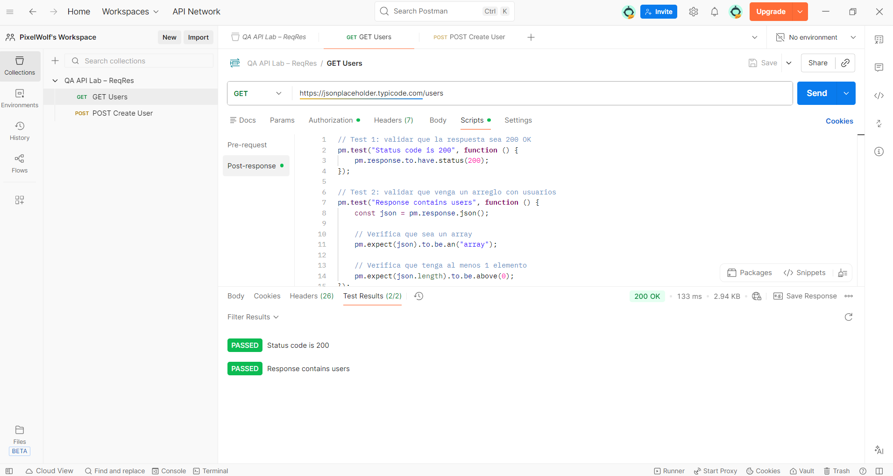

# QA API + SQL Mini Lab


Mini laboratorio práctico de QA enfocado en:

- Testing de APIs con Postman  
- Validación de respuestas HTTP (GET / POST)  
- Automatización básica con scripts (Post-response)  
- Validación de datos con SQLite (SQL)

Este proyecto simula un flujo real de trabajo QA: consumo de API + verificación de backend.

---

## 🧰 Tecnologías utilizadas

- Postman Desktop  
- JavaScript (Postman Scripts)  
- SQLite  
- Git / GitHub  

---

## 📁 Estructura del proyecto

````text
qa-api-sql-lab/
│
├── postman/
│ └── qa-api-collection.json
│
├── sql/
│ └── init.sql
│
└── README.md
````

---

## 🚀 Parte 1 – API Testing con Postman

### GET Users

Endpoint utilizado:
```
https://jsonplaceholder.typicode.com/users
```

Validaciones realizadas:

- Status code 200  
- La respuesta es un array  
- Contiene al menos un usuario  

**Script Post-response**:

```javascript
pm.test("Status code is 200", function () {
    pm.response.to.have.status(200);
});

pm.test("Response contains users", function () {
    const json = pm.response.json();
    pm.expect(json).to.be.an("array");
    pm.expect(json.length).to.be.above(0);
});
```
---

### POST Create User

 ```javascript
https://jsonplaceholder.typicode.com/users
```

Body enviado:
```
{
  "name": "Pablo",
  "email": "pablo@test.com"
}
```

Validaciones:

- Status code 201 (Created)

- El usuario contiene nombre y email

- Los valores coinciden con los enviados

**Script Post-response**:

```javascript
pm.test("Status code is 201", function () {
    pm.response.to.have.status(201);
});


pm.test("User created correctly", function () {
    const json = pm.response.json();


    pm.expect(json).to.have.property("name");
    pm.expect(json).to.have.property("email");


    pm.expect(json.name).to.eql("Pablo");
    pm.expect(json.email).to.eql("pablo@test.com");
});
```
La colección Postman se encuentra exportada en:
```
/postman/qa-api-collection.json
```
---

## 🗄️ Parte 2 – Validación con SQL (SQLite)

Se creó una base de datos local simulando backend.

Uso de **sqlite-tools-win-x64-3510200** descomprimido en: 
```
C:\sqlite
```

### **Crear base de datos**

Desde PowerShell:

```
.\sqlite3 users.db
```
### **Crear tabla**
```sql
CREATE TABLE users (
  id INTEGER PRIMARY KEY,
  name TEXT,
  email TEXT
);
```

### **Insertar datos**
```sql
INSERT INTO users VALUES (1,'Pablo','pablo@test.com');
INSERT INTO users VALUES (2,'Ana','ana@test.com');
```
### **Consultar usuarios**
```
SELECT * FROM users;
```

### **Resultado esperado:**
```
1|Pablo|pablo@test.com
2|Ana|ana@test.com
```
---
## 🎯 Objetivo del laboratorio

- Demostrar competencias en:

- API Testing con Postman

- Escritura de assertions

- Validación de payload

- Uso básico de SQL

- Flujo QA end-to-end
---
## ▶️ Cómo ejecutar este laboratorio

### Requisitos

- Postman Desktop instalado  
- SQLite descargado  
- PowerShell o terminal en Windows  

### Pasos

1. Importar la colección Postman ubicada en:

/postman/qa-api-collection.json

2. Ejecutar las requests GET y POST desde Postman.

3. Verificar que los tests aparezcan como PASSED.

4. Crear la base de datos SQLite:

```powershell
.\sqlite3 users.db
```
Ejecutar el script SQL ubicado en la carpeta:

/sql/init.sql

5. Verificar que los datos se hayan insertado correctamente ejecutando:
```sql
SELECT * FROM users;
```

---

## 📸 Postman Test Results



---

## 📚 Lo que aprendí

- Realizar pruebas básicas de APIs usando Postman (requests GET y POST).
- Escribir assertions en JavaScript para validar códigos de estado y payloads.
- Crear scripts Post-response para automatizar validaciones.
- Simular persistencia de datos usando SQLite.
- Ejecutar consultas SQL básicas para verificar integridad de datos.
- Comprender un flujo QA end-to-end: consumo de API → validación → verificación backend.
- Documentar el trabajo QA de forma clara para revisión técnica.

---
## 👤 Autor

**Pablo Amion**

QA Automation / QA Analyst Junior

---
## 📄 Licencia

Este proyecto está bajo la licencia MIT.

Puedes usar, copiar, modificar y distribuir este código libremente, siempre que se mantenga el aviso de copyright original.

Ver archivo `LICENSE` para más detalles.
